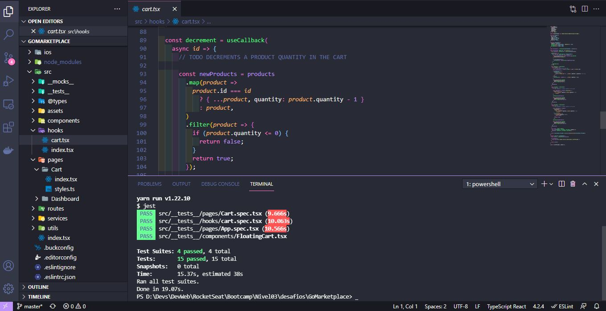
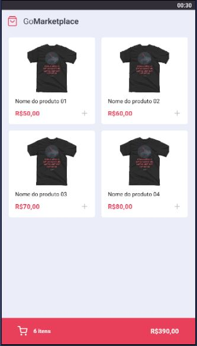
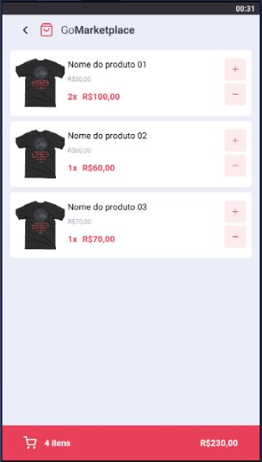

<h3 align="center">
  Desafio 08: Fundamentos React-Native
</h3>

  <a href="#rocket-o-desafio">O desafio</a>&nbsp;&nbsp;&nbsp;|&nbsp;&nbsp;&nbsp;
  <a href="#hammer-testes">Testes</a>&nbsp;&nbsp;&nbsp;|&nbsp;&nbsp;&nbsp;
  <a href="#iphone-imagens">Testes</a>&nbsp;&nbsp;&nbsp;|&nbsp;&nbsp;&nbsp;
  <a href="#snowflake-template">Template</a>&nbsp;&nbsp;&nbsp;|&nbsp;&nbsp;&nbsp;
  <a href="#gear-tecnologias-e-ferramentas">Tecnologias e ferramentas</a>&nbsp;&nbsp;&nbsp;|&nbsp;&nbsp;&nbsp;
  <a href="#memo-licença">Licença</a>

## :rocket: O desafio
Nesse desafio, desenvolverá uma nova aplicação, a GoMarketplace. Dessa vez é hora de você praticar o que você aprendeu até agora no React Native, junto com TypeScript, utilizando rotas, Async Storage e a Context API.

Neste desafio testados nossos conhecimentos dos fundamentos de React-Native com TypeScript criando uma aplicação mobile a GoMarketplace simula uma loja virtual, adicionando produtos no carrinho, assim somando/subtraindo as quantidade quantidade nele armazenadas, utilizando rotas, Async Storage, Context API e um server FAKE com json-server.

## :hammer: Testes

Aqui esta uma print dos testes realizados com sucesso.

## :iphone: Imagens

Alguns prints da aplicação:

## :snowflake: Template

Foi utilizado o template do disponibilizado pela RocketSeat, onde criamos uma imagem em nosso próprio repositório e clonado em nosso ambiênte de desenvolvimento.

## :gear: Tecnologias e ferramentas

Foram utilizadas as tecnologias e ferramentas:
* [React-Native](https://reactnative.dev/)
* [NodeJs](https://nodejs.org/)
* [Axios](https://github.com/axios/axios/)
* [Typescript](https://www.typescriptlang.org/)
* [TypeORM](https://typeorm.io/#/)
* [Docker](https://www.docker.com/)
* [Postgres](https://www.postgresql.org/)
* [jest](https://www.npmjs.com/package/jest)

## :memo: Licença

Esse projeto está sob a licença MIT. Veja o arquivo [LICENSE](LICENSE.md) para mais detalhes.

